# 调研目标

本次调研是为了实现在**对kafka 客户端尽可能少的代码改变**的情况下，使用htp系统实现kafka发布订阅相关功能。

- 理想情况下，应该不需要对客户端原有代码进行任何改变，只需要变动broker地址。

在htp架构和协议与kafka架构和协议存在巨大差异的情况下，为了实现该目标，我们需要一个**代理服务器**，对kafka客户端发送的请求进行解析，然后将消息存入htp系统中或从htp系统中获取信息，然后以对应的kafka协议对kafka客户端进行响应。

# kafka架构概述

在消息拉取和发送的过程中，可以分为 produce,customer,broker 三个角色。

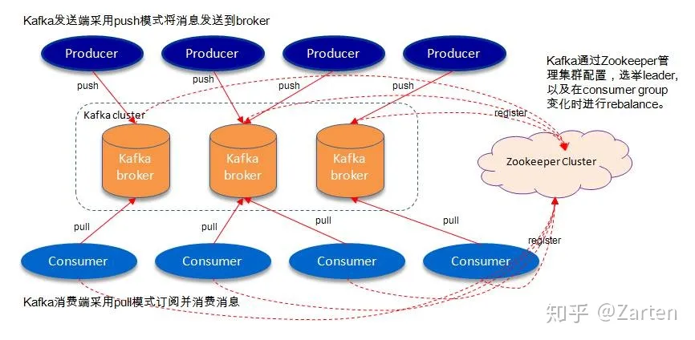

## 名词解释

- topic:

Kafka对消息进行归类，发送到集群的每一条消息都要指定一个topic

- Partition:

物理上的概念，每个topic包含一个或多个partition，一个partition对应一个文件夹，这个文件夹下存储partition的数据和索引文件，每个partition内部是有序的

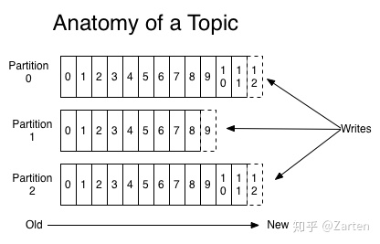

replicas：对每个partition而言，或有多个副本，副本数量取决于topic的复制因子，kafka会尽量把副本放到不同的broker上。对每个partition的副本，会由leader和follower两种角色，消息发送时，producer只会发送给leader。消息拉取时，若不指定优先副本或优先副本已挂，也会从leader拉取。

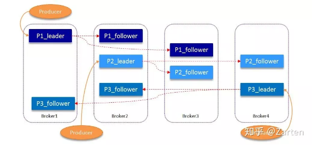

customeGroup：

consumer group是kafka提供的可扩展且具有容错性的消费者机制。组内可以有多个消费者或消费者实例(consumer instance)，它们共享一个公共的ID，即group ID。组内的所有消费者协调在一起来消费订阅主题(subscribed topics)的所有分区(partition)。每个分区只能由同一个消费组内的一个consumer来消费。

- 一个consumer group下可以有一个或多个consumer instance，consumer instance可以是一个进程，也可以是一个线程
- group.id是一个字符串，唯一标识一个consumer group
- consumer group下订阅的topic下的每个分区只能分配给某个group下的一个consumer(当然该分区还可以被分配给其他group)

## Kafka 如何保证高可靠

1. 数据可靠性
   
   Kafka 的**分区多副本架构**是 Kafka 可靠性保证的核心，把消息写入多个副本可以使Kafka 在发生崩溃时仍能保证消息的持久性。
   
   - Producter往Broker发送消息基于 acks 的消息确认机制
     
     - acks = 0
       
       意味着如果生产者能够通过网络把消息发送出去，那么就认为消息已成功写入Kafka。在这种情况下还是有可能发生错误，比如发送的对象未能被序列化或者网卡发生故障。
     
     - acks = 1
       
       意味若 Leader 在收到消息并把它写入到分区数据文件（不一定同步到磁盘上）时会返回确认或错误响应。在这个模式下，如果发生正常的 Leader 选举，生产者会在选举时收到一个 LeaderNotAvailableException 异常，如果生产者能恰当地处理这个错误，它会重试发送悄息，最终消息会安全到达新的 Leader 那里。不过在这个模式下仍然有可能丢失数据，比如消息已经成功写入 Leader，但在消息被复制到 follower 副本之前 Leader发生崩溃。
     
     - acks = all（这个和 request.required.acks = -1 含义一样）
       
       意味着 Leader 在返回确认或错误响应之前，会等待所有同步副本都收到悄息。如果和 min.insync.replicas 参数结合起来，就可以决定在返回确认前至少有多少个副本能够收到悄息，生产者会一直重试直到消息被成功提交。不过这也是最慢的做法，因为生产者在继续发送其他消息之前需要等待所有副本都收到当前的消息。
   
   - 分区多副本机制
     . leader选举机制

2. 数据一致性
   
   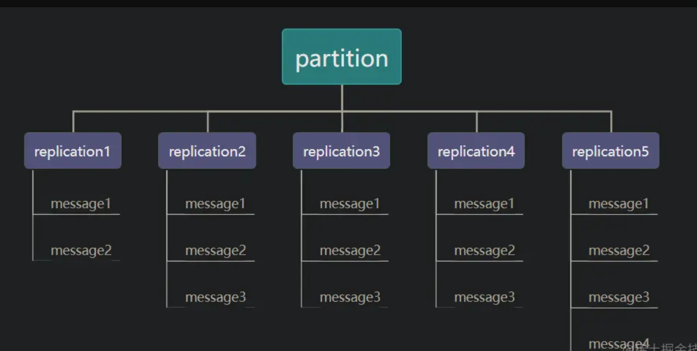
   
   假设分区的副本为5，其中副本5是 Leader，其他副本是 follower，并且在 ISR 列表里面。虽然副本5已经写入了 Message4，但是 Consumer 只能读取到 Message2。因为所有的 ISR 都同步了 Message2，只有 High Water Mark 以上的消息才支持 Consumer 读取，而 High Water Mark 取决于 ISR 列表里面偏移量最小的分区。
   这样做的原因是还没有被足够多副本复制的消息被认为是不安全的，如果 Leader 发生崩溃，另一个副本成为新 Leader，那么这些消息很可能丢失了。如果我们允许消费者读取这些消息，可能就会破坏一致性。试想，一个消费者从当前 Leader（副本0） 读取并处理了 Message4，这个时候 Leader 挂掉了，选举了副本1为新的 Leader，这时候另一个消费者再去从新的 Leader 读取消息，发现这个消息其实并不存在，这就导致了数据不一致性问题。
   当然，引入了 High Water Mark 机制，会导致 Broker 间的消息复制因为某些原因变慢，那么消息到达消费者的时间也会随之变长（因为我们会先等待消息复制完毕）。延迟时间可以通过参数 replica.lag.time.max.ms 参数配置，它指定了副本在复制消息时可被允许的最大延迟时间。

## kafka效率保证

1. 顺序读写

2. 零拷贝

3. 文件分段

4. 批量发送

5. 数据压缩

# kakfa发布订阅模式Api

## 生产者

- initTransactions
  初始化事务
- beginTransaction
  开始一个事务
- sendOffsetsToTransaction
- commitTransaction
- abortTransaction
- send
  生产者发送消息
- partitionsFor
  获取一个主题的所有分区信息

## 消费者

- subscribe
  订阅主题，提供主题订阅模式和正则订阅模式

- unsubscribe
  取消订阅

- assignment
  获取分区分配结果

- assign
  强制指定分区分配，与subscirbe方法不同，assign方法由用户直接手动consumer实例消费哪些具体分区，根据api上述描述，assign的consumer不会拥有kafka的group management机制，也就是当group内消费者数量变化的时候不会有reblance行为发生。

- poll 
  拉取消息，kafka 消费者的核心逻辑，消费者仅有一个独立的心跳维护线程。需要用户循环或定时调用poll。
  在每个轮询中，消费者将尝试使用最后消耗的偏移量作为起始偏移量并按顺序提取。最后 消费偏移量可以通过seek(TopicPartition，long) 手动设置，也可以自动设置为上次提交 分区订阅列表的偏移量

- commitSync
  
  同步提交offset

- commitAsync 
  异步提交offset

- seek/seekToBeginning/seekToEnd
  覆盖消费者将在下一次poll(timeout) 中使用的fetch偏移量。如果此API 为同一分区调用多次，则将在下一个poll() 上使用最新的偏移量。 如果在消费过程中任意使用此API来重置获取偏移量，则可能会丢失数据

- position
  获取将要获取的下一条记录的偏移量 (如果存在具有该偏移量的记录)。 如果没有当前位置，此方法可能会向服务器发出远程调用 。

- committed
  
  获取给定分区的最后提交偏移量 (无论是其他消费组提交的还是当前消费者提交的)。

- partitionsFor
  获取关于给定主题的分区的元数据。

- listTopics
  
  获取有关用户有权查看的所有主题的分区的元数据

- pause
  
  暂停从请求的分区中获取。以后调用poll(Duration) 不会返回 这些分区中的任何记录，直到使用resume(Collection) 恢复为止。 请注意，此方法不影响分区订阅。它不会导致消费组使用自动分配时的再平衡。 注意: Rebalance不会保留暂停/恢复状态。

- resume
  
  使用暂停 (收集) 恢复已暂停的分区。

- paused
  
  获取之前被调用pause(Collection) 暂停的分区集

- offsetsForTimes\beginningOffsets\endOffsets
  
  某个时刻的offset查询

- groupMetadata
  
  消费组相关元数据（id,memberid,generationId,groupInstanceId）

- enforceRebalance
  
  通过重新加入组来提醒消费者触发新的再平衡。这是一个非阻塞呼叫，它迫使 消费者在下一次调用poll(Duration) 时触发新的rebalance。如果您希望强制进行额外的重新平衡，则必须完成当前 一个通过在重试此API之前调用轮询。

# kakfa协议&网络概述

[Apache Kafka 协议参考](https://kafka.apache.org/protocol#protocol_preliminaries)

### 网络

kafka 基于tcp协议。由客户端发起socket连接，然后安顺序发起请求并接受对应的响应。

客户端需要维护到多个broker的连接。但是通常来说，单个客户端对单个broker不需要连接池，只需要维护一个连接。

服务端保证了对单个tcp连接，**请求会按照送达顺序被处理，并按照同样的顺序返回**。(由Selector 和 Processor保证，同时影响了客户端底层设计)

### 分区和启动

kafka是一个分区系统，不是说有的srevers都有完整的数据，数据会被分散在不同的分区中，每个分区都会有各自的复制。

消息发送到哪个分区中由client决定，broker不会强制指定哪些消息应该被发送到特定的分区中。

拉取或者发送消息的请求必须发送给当前分区的leader，leader选举由broker完成。

所有的kafka broker都可以返回 主题是否存在，主题有哪些分区，哪个地址可以被直接连接来发送请求的 元信息，

client 不需要通过平凡的轮询来查询集群的变化，可以拉取一次元数据然后缓存它，直到接收到元数据过期的错误。这个错误可以来着以下2钟情况：1，某个特定的broker 发生socket错误，2.在响应做特定的错误码标识（ps:实际上MetaData有个可配置的有效期时间，超过这个有效期时间后会去更新MetaData）

### 分区策略

kafka分区策略是客户端可以实现的一个部分。可以使用kafka提供的分区策略或在客户端自定义分区策略来实现消息均衡或将特定的消息发送到特定的分区中。

### 批量

kafka api 鼓励你把小东西批量放在一起来提高效率。

### 兼容性

kafka具有双向兼容性。旧客户端可以新broker 发起请求， 新客户端也可以向旧broker发起请求。在所有的请求被发送前，client会发送API KEY 和 API VERSION，都是16bit的number。

下图是协商支持的api版本流程


### SASL授权流程

todo

# 通用协议

#### API_VERSION

##### 功能

kafka兼容性实现支撑协议，查询服务端支持的协议版本，客户端会根据返回的值使用双方支持的最高协议版本构建请求。生产者和消费总是在一开始就发送该协议。

#### METADATA

##### 功能

查询主题对应的分区信息元数据，消费者和生产者均会查询。查询时机由没有对应主题的元数据或metadata过期时间共同控制 ， 对应参数：metadata.max.age.ms，实际客户端的代码中，会再NetworkClient的poll()方法中进行检查。

- 需要返回所有的broker节点信息

- 需要返回对应topic的分区信息

- 如果配置允许，创建不存在的topic

- 如果未指定查询的topic,需要返回所有的topic(eg. 消费者正则模式)

##### 相关错误码

```
Errors.LISTENER_NOT_FOUND
Errors.INVALID_TOPIC_EXCEPTION
Errors.TOPIC_AUTHORIZATION_FAILED
```

##### 协议详情

- 请求
  
  ```
  Metadata Request (Version: 12) => [topics] allow_auto_topic_creation include_topic_authorized_operations TAG_BUFFER 
  topics => topic_id name TAG_BUFFER 
  topic_id => UUID
   name => COMPACT_NULLABLE_STRING
   allow_auto_topic_creation => BOOLEAN
   include_topic_authorized_operations => BOOLEAN
  ```
  
  | FIELD                               | DESCRIPTION                                                                                                                                                        |
  | ----------------------------------- |:------------------------------------------------------------------------------------------------------------------------------------------------------------------ |
  | topics                              | The topics to fetch metadata for.<br/>消费者以正则模式拉取时，topics为空数组，此时服务端需要返回所有的topic                                                                                     |
  | topic_id                            | The topic id.                                                                                                                                                      |
  | name                                | The topic name.                                                                                                                                                    |
  | _tagged_fields                      | The tagged fields                                                                                                                                                  |
  | allow_auto_topic_creation           | If this is true, the broker may auto-create topics that we requested which do not already exist, if it is configured to do so.<br/>客户端默认发送为true,是否创建取决于broker本身的配置 |
  | include_topic_authorized_operations | Whether to include topic authorized operations.kafka admin client<br/> 相关功能，客户端默认为false                                                                            |
  | _tagged_fields                      | The tagged fields                                                                                                                                                  |

- 响应
  
  ```
  Metadata Response (Version: 12) => throttle_time_ms [brokers] cluster_id controller_id [topics] TAG_BUFFER 
    throttle_time_ms => INT32
    brokers => node_id host port rack TAG_BUFFER 
      node_id => INT32
      host => COMPACT_STRING
      port => INT32
      rack => COMPACT_NULLABLE_STRING
    cluster_id => COMPACT_NULLABLE_STRING
    controller_id => INT32
    topics => error_code name topic_id is_internal [partitions] topic_authorized_operations TAG_BUFFER 
      error_code => INT16
      name => COMPACT_NULLABLE_STRING
      topic_id => UUID
      is_internal => BOOLEAN
      partitions => error_code partition_index leader_id leader_epoch [replica_nodes] [isr_nodes] [offline_replicas] TAG_BUFFER 
        error_code => INT16
        partition_index => INT32
        leader_id => INT32
        leader_epoch => INT32
        replica_nodes => INT32
        isr_nodes => INT32
        offline_replicas => INT32
      topic_authorized_operations => INT32
  ```
  
  | FIELD                       | DESCRIPTION                                                                                                                                                                                                                                                                                                                                                            |
  | --------------------------- | ---------------------------------------------------------------------------------------------------------------------------------------------------------------------------------------------------------------------------------------------------------------------------------------------------------------------------------------------------------------------- |
  | throttle_time_ms            | The duration in milliseconds for which the request was throttled due to a quota violation, or zero if the request did not violate any quota.                                                                                                                                                                                                                           |
  | brokers                     | Each broker in the response.<br/>所有的brokers                                                                                                                                                                                                                                                                                                                            |
  | node_id                     | The broker ID.<br/>后续的所有协议均会以id 来寻找地址                                                                                                                                                                                                                                                                                                                                  |
  | host                        | The broker hostname.                                                                                                                                                                                                                                                                                                                                                   |
  | port                        | The broker port.                                                                                                                                                                                                                                                                                                                                                       |
  | rack                        | The rack of the broker, or null if it has not been assigned to a rack.null 即可                                                                                                                                                                                                                                                                                          |
  | _tagged_fields              | The tagged fields                                                                                                                                                                                                                                                                                                                                                      |
  | cluster_id                  | The cluster ID that responding broker belongs to.                                                                                                                                                                                                                                                                                                                      |
  | controller_id               | The ID of the controller broker.<br/>如果没有控制器 可以使用MetadataResponse.*NO_CONTROLLER_ID*（-1）[Kafka实战宝典：Kafka的控制器controller详解 - 腾讯云开发者社区-腾讯云 (tencent.com)](https://cloud.tencent.com/developer/article/1688442)主要用于admin client.<br/>对客户端的逻辑没有影响。                                                                                                                          |
  | topics                      | Each topic in the response.                                                                                                                                                                                                                                                                                                                                            |
  | error_code                  | The topic error, or 0 if there was no error.                                                                                                                                                                                                                                                                                                                           |
  | name                        | The topic name.                                                                                                                                                                                                                                                                                                                                                        |
  | topic_id                    | The topic id.                                                                                                                                                                                                                                                                                                                                                          |
  | is_internal                 | True if the topic is internal.<br/>kafka内部topic,一般为false。典型的内部topic有____custom_offset,这个topic是用来管理消费进度的。                                                                                                                                                                                                                                                               |
  | partitions                  | Each partition in the topic.                                                                                                                                                                                                                                                                                                                                           |
  | error_code                  | The partition error, or 0 if there was no error.                                                                                                                                                                                                                                                                                                                       |
  | partition_index             | The partition index.                                                                                                                                                                                                                                                                                                                                                   |
  | leader_id                   | The ID of the leader broker.                                                                                                                                                                                                                                                                                                                                           |
  | leader_epoch                | The leader epoch of this partition.参考文档：[KIP-101 - 更改复制协议以使用 Leader Epoch 而不是 High Watermark 进行截断 (qq.com)](https://mp.weixin.qq.com/s?__biz=MjM5NzgyODc1Mw==&mid=2647754415&idx=1&sn=3dd59403fb1391a41d3f024f17cba7e3&chksm=bef127518986ae47f8382c8a171591345bd84ef96fbff4523b373728b79d0f3c953fbd471b9f&token=647212035&lang=zh_CN#rd)用来同步水位控制消息生产过程中会提交这个字段,对我们可以忽略 |
  | replica_nodes               | The set of all nodes that host this partition.这个partition 全部的节点（leader and follower）                                                                                                                                                                                                                                                                                   |
  | isr_nodes                   | The set of nodes that are in sync with the leader for this partition.<br/>同步中的副本，给adminClinet 使用的                                                                                                                                                                                                                                                                      |
  | offline_replicas            | The set of offline replicas of this partition.已经离线的副本，给adminClinet 使用的                                                                                                                                                                                                                                                                                                 |
  | _tagged_fields              | The tagged fields                                                                                                                                                                                                                                                                                                                                                      |
  | topic_authorized_operations | 32-bit bitfield to represent authorized operations for this topic.//默认值 -2147483648，对客户端无影响，使用在kafkaAdminClinet中                                                                                                                                                                                                                                                       |
  | _tagged_fields              | The tagged fields                                                                                                                                                                                                                                                                                                                                                      |
  | _tagged_fields              | The tagged fields                                                                                                                                                                                                                                                                                                                                                      |

# 生产者相关协议

#### PRODUCE

##### 功能

生产者发送消息

- kafka发送消息是会尽可能的以批量的模式发送

- 消息协议格式在kafka 0.10.0发生过一次变更，一下讨论以新版本为准

- 如果客户端选择了压缩算法kafka消息再发送中已经被压缩过

##### 请求

```
Produce Request (Version: 9) => transactional_id acks timeout_ms [topic_data] TAG_BUFFER 
  transactional_id => COMPACT_NULLABLE_STRING
  acks => INT16
  timeout_ms => INT32
  topic_data => name [partition_data] TAG_BUFFER 
    name => COMPACT_STRING
    partition_data => index records TAG_BUFFER 
      index => INT32
      records => COMPACT_RECORDS
```

| FIELD            | DESCRIPTION                                                                                                                                                                                                                                                                                 |
| ---------------- | ------------------------------------------------------------------------------------------------------------------------------------------------------------------------------------------------------------------------------------------------------------------------------------------- |
| transactional_id | The transactional ID, or null if the producer is not transactiona.<br/>暂不支持事务                                                                                                                                                                                                               |
| acks             | The number of acknowledgments the producer requires the leader to have received before considering a request complete. Allowed values: 0 for no acknowledgments, 1 for only the leader and -1 for the full ISR.<br/>副本同步参数acks 0不需要等待同步，等于0的时候，不需要broker返回responseacks 1仅leader //RAFT-1 全部 |
| timeout_ms       | The timeout to await a response in milliseconds.                                                                                                                                                                                                                                            |
| topic_data       | Each topic to produce to.                                                                                                                                                                                                                                                                   |
| name             | The topic name.                                                                                                                                                                                                                                                                             |
| partition_data   | Each partition to produce to.                                                                                                                                                                                                                                                               |
| index            | The partition index.                                                                                                                                                                                                                                                                        |
| records          | The record data to be produced.                                                                                                                                                                                                                                                             |
| _tagged_fields   | The tagged fields                                                                                                                                                                                                                                                                           |
| _tagged_fields   | The tagged fields                                                                                                                                                                                                                                                                           |
| _tagged_fields   | The tagged fields                                                                                                                                                                                                                                                                           |

##### 消息结构

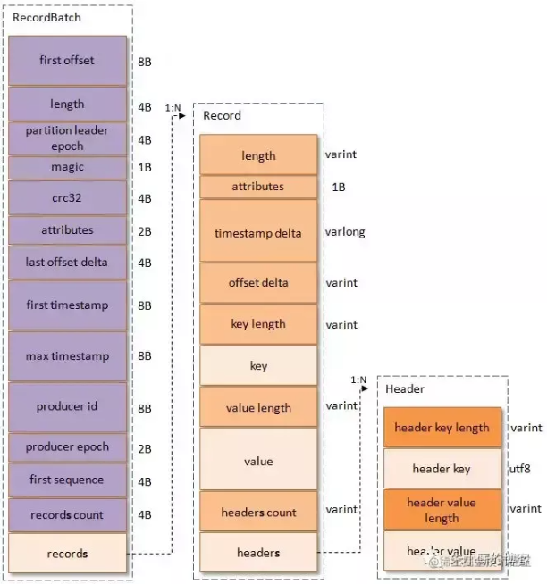

对应类：

[org.apache.kafka.common.record.DefaultRecordBatch](https://github.com/apache/kafka/blob/trunk/clients/src/main/java/org/apache/kafka/common/record/DefaultRecordBatch.java)

[org.apache.kafka.common.record.RecordBatch](https://github.com/apache/kafka/blob/3.0/clients/src/main/java/org/apache/kafka/common/record/RecordBatch.java)

[Apache Kafka messageformat](https://kafka.apache.org/documentation/#messageformat)

RecordBatch

| 字段                   | 类型       | 说明                                                                                  |
| -------------------- | -------- | ----------------------------------------------------------------------------------- |
| baseOffset           | int64    | 当前 RecordBatch起始位置。Record 中的 offset delta与该baseOffset相加才得到真正的offset值                |
| batchLength          | int32    | RecordBatch 总长 (byte lenght , 包括头和所有的record)                                        |
| partitionLeaderEpoch | int32    | 标记 partition 中 leader replica 的元信息                                                  |
| magic                | int8     | 版本的魔术值，V2版本魔术值为2                                                                    |
| crc                  | int32    | 校验码， 效验部分从开始到结束全部数据，但除了partitionLeaderEpoch值                                        |
| attributes           | int16    | 消息属性，0~2:表示压缩类型 第3位：时间戳类型 第4位：是否是事务型记录 5表示ControlRecord，这类记录总是单条出现，它只在broker内处理     |
| lastOffsetDelta      | int32    | RecordBatch 最后一个 Record 的相对位移，用于 broker 确认 RecordBatch 中 Records 的组装正确性             |
| firstTimestamp       | int64    | RecordBatch 第一条 Record 的时间戳                                                         |
| maxTimestamp         | int64    | RecordBatch 中最大的时间戳，一般情况下是最后一条Record的时间戳，用于 broker 判断 RecordBatch 中 Records 的组装是否正确 |
| producerId           | int64    | 生产者编号，用于支持幂等性（Exactly Once 语义）                                                      |
| producerEpoch        | int16    | 同producerEpoch，支持幂等性                                                                |
| baseSequence         | int32    | 同上，支持幂等性，也用于效验是否重复Record                                                            |
| records              | [Record] |                                                                                     |

Record

| 字段              | 类型       | 说明                     |
| --------------- | -------- | ---------------------- |
| length          | varints  | 消息中长度                  |
| attributes      | int8     | unused，没有使用了，但仍占据了1B大小 |
| timestamp delta | varlong  | 时间戳增量。一般占据8个字节         |
| offset delta    | varint   | 位移增量                   |
| key length      | varint   | key的长度                 |
| key             | byte[]   | key的值                  |
| valuelen        | varint   | value值的长度              |
| value           | byte[]   | value的实际值              |
| headers         | [header] | 头部结构，支持应用级别的扩展         |

Header

| 字段                | 类型      | 说明       |
| ----------------- | ------- | -------- |
| headerKeyLength   | varints | 头部key的长度 |
| headerKey         | string  | 头部 key值  |
| headerValueLength | varint  | 头部值的长度   |
| value             | byte[]  | header的值 |

##### 响应

```
Produce Response (Version: 9) => [responses] throttle_time_ms TAG_BUFFER 
  responses => name [partition_responses] TAG_BUFFER 
    name => COMPACT_STRING
    partition_responses => index error_code base_offset log_append_time_ms log_start_offset [record_errors] error_message TAG_BUFFER 
      index => INT32
      error_code => INT16
      base_offset => INT64
      log_append_time_ms => INT64
      log_start_offset => INT64
      record_errors => batch_index batch_index_error_message TAG_BUFFER 
        batch_index => INT32
        batch_index_error_message => COMPACT_NULLABLE_STRING
      error_message => COMPACT_NULLABLE_STRING
  throttle_time_ms => INT32
```

| FIELD                     | DESCRIPTION                                                                                                                                                                                                                                       |
| ------------------------- | ------------------------------------------------------------------------------------------------------------------------------------------------------------------------------------------------------------------------------------------------- |
| responses                 | Each produce response                                                                                                                                                                                                                             |
| name                      | The topic name                                                                                                                                                                                                                                    |
| partition_responses       | Each partition that we produced to within the topic.                                                                                                                                                                                              |
| index                     | The partition index.                                                                                                                                                                                                                              |
| error_code                | The error code, or 0 if there was no error.                                                                                                                                                                                                       |
| base_offset               | The base offset.<br/>（该批次的base_offset,客户端会根据base_offset 计算offset，并且在事务管理器种会记录该base_offset到TxnPartitionEntry.lastAckedOffset中）                                                                                                                     |
| log_append_time_ms        | The timestamp returned by broker after appending the messages. If CreateTime is used for the topic, the timestamp will be -1. If LogAppendTime is used for the topic, the timestamp will be the broker local time when the messages are appended. |
| log_start_offset          | The log start offset<br/>.分段日志起始位置（客户端没有用到）                                                                                                                                                                                                       |
| record_errors             | The batch indices of records that caused the batch to be dropped<br/>发送错误的records                                                                                                                                                                 |
| batch_index               | The batch index of the record that cause the batch to be dropped                                                                                                                                                                                  |
| batch_index_error_message | The error message of the record that caused the batch to be dropped                                                                                                                                                                               |
| _tagged_fields            | The tagged fields                                                                                                                                                                                                                                 |
| error_message             | The global error message summarizing the common root cause of the records that caused the batch to be dropped                                                                                                                                     |
| _tagged_fields            | The tagged fields                                                                                                                                                                                                                                 |
| _tagged_fields            | The tagged fields                                                                                                                                                                                                                                 |
| throttle_time_ms          | The duration in milliseconds for which the request was throttled due to a quota violation, or zero if the request did not violate any quota.                                                                                                      |
| _tagged_fields            | The tagged fields                                                                                                                                                                                                                                 |

##### 相关错误码

```
Errors.MESSAGE_TOO_LARGE
Errors.DUPLICATE_SEQUENCE_NUMBER
Errors.TOPIC_AUTHORIZATION_FAILED
Errors.CLUSTER_AUTHORIZATION_FAILED
 //batch_index_error_message 可以自定义提示语
```

##### 消息压缩

kafka broker默认消息压缩配置 为produce,表示尊重客户端使用的压缩算法，在压缩算法一致时，kafka broker 会将客户端的发送的消息整个储存下来，消费者拉取后，由消费者负责解压。如果不一致，会broker会解压后重新进行压缩。

produce消息压缩发生于`tryAppend` 过程中.此时写入的消息所有属性均已经被压缩
RecordBatch 头部属性修改 发生于 Sender 阶段，具体见
`Sender.sendProducerData() ->accumulator.drain() ->drainBatchesForOneNode()->batch.close()->recordsBuilder.close()`

不发生重新压缩的情况下，kafka broker直接储存整个RecordBatch 的data 部分,消息解压一般为customer完成

#### InitProducerId

##### 功能

实现生产者幂等,或者开始事务时，会向broker 申请ALLOCATE_PRODUCER_IDS,

ENABLE_IDEMPOTENCE_CONFIG 默认是true的

##### 请求

```
InitProducerId Request (Version: 4) => transactional_id transaction_timeout_ms producer_id producer_epoch TAG_BUFFER 
transactional_id => COMPACT_NULLABLE_STRING
 transaction_timeout_ms => INT32
 producer_id => INT64
 producer_epoch => INT16
```

| FIELD                  | DESCRIPTION                                                                                                                                             |
| ---------------------- | ------------------------------------------------------------------------------------------------------------------------------------------------------- |
| transactional_id       | The transactional id, or null if the producer is not transactional.                                                                                     |
| transaction_timeout_ms | The time in ms to wait before aborting idle transactions sent by this producer. This is only relevant if a TransactionalId has been defined.            |
| producer_id            | The producer id. This is used to disambiguate requests if a transactional id is reused following its expiration.                                        |
| producer_epoch         | The producer's current epoch. This will be checked against the producer epoch on the broker, and the request will return an error if they do not match. |
| _tagged_fields         | The tagged fields                                                                                                                                       |

##### 响应

```
InitProducerId Response (Version: 4) => throttle_time_ms error_code producer_id producer_epoch TAG_BUFFER 
throttle_time_ms => INT32
 error_code => INT16
 producer_id => INT64
 producer_epoch => INT16
```

| FIELD            | DESCRIPTION                                                                                                                                  |
| ---------------- | -------------------------------------------------------------------------------------------------------------------------------------------- |
| throttle_time_ms | The duration in milliseconds for which the request was throttled due to a quota violation, or zero if the request did not violate any quota. |
| error_code       | The error code, or 0 if there was no error.                                                                                                  |
| producer_id      | The current producer id.                                                                                                                     |
| producer_epoch   | The current epoch associated with the producer id.                                                                                           |
| _tagged_fields   | The tagged fields                                                                                                                            |

#### 消息发送流程概述

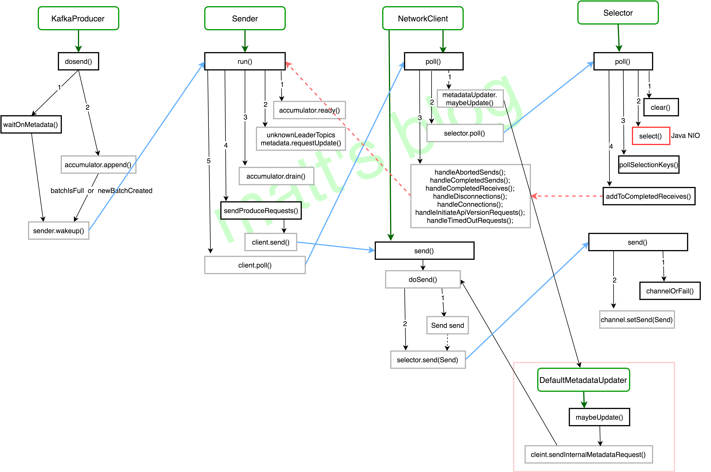

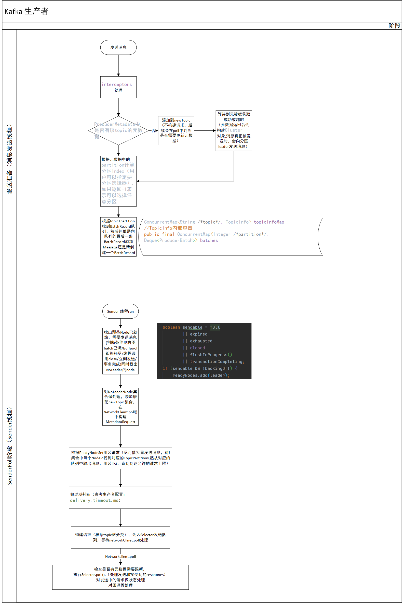

- 用户消息发送线程
  
  - produce 发送消息
  
  - 调用可能存在的interceptor处理
  
  - 阻塞到对应topic的元数据获取成功（确定分片信息等）
    
    - 如果能获取到对应的元数据直接返回
    
    - 否则添加需要查询元数据标识并且阻塞到超时或获取元数据成功。
  
  - 根据分区策略计算分区
  
  - 根据分区和主题计算出消息存放的队列
    
    - 如果队列不存在则初始化
  
  - 将该条消息放入队列中
    
    - 如果队列中最后一个BatchRecord 未达到最大容量，将消息放入该BatchRecord
    
    - 否则将创建一个新的BatchRecord,然后添加该条消息。
    
    - 在消息加入BatchRecord的过程中，将会使用对应的压缩算法进行消息压缩。

- sender线程
  
  - sender.runOnce
  
  - 检查是否需要更新元数据，如果需要构建metadataRequst
  
  - 轮询检查出所有已就绪的broker节点
  
  - 根据节点Id从累加器中找出需要发往该节点的消息然后进行批量打包
    
    - 会以topicPartition分组
  
  - 构建请求
  
  - selector.poll，详见后续的Selector概述章节

# 消费者相关协议

## 消费者初始化&rebalance流程概述

kafka消费者在同一个组内，一个partition最多只能被一个消费者消费，来保证消息的顺序性消费，同时可以实现kafka的拉取消息offset由customer维护。为了保证一个partition最多只能被一个消费者消费，在有customer启动/宕机的时，会发生rebalance。再均衡和消息拉取中会涉及以下名词：

- cooridinator
  消费组协调者，负责对消费组内的消费者进行分配结果协调，同时管理offset,组成员等，由特定的broker承担。

- customer group
  消费组，不同的消费组互相独立，相同的消费组内的消费者共享消费进度（committed_offset）

- customer group leader
  消费者leader,负责在rebalance时，根据分区分配策略计算分配结果。

消费组启动/再均衡流程：

  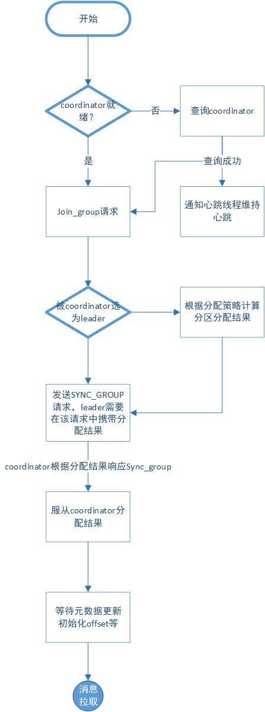

- 查找或等到coordinator可用
  
  - 如果coordinator可用是，唤醒心跳线程，维护定时心跳发送
  
  - 心跳响应可以通过特定的错误码来告知customer进入重平衡流程

- 发起join_group
  
  - 消费者初始化或被心跳响应通知后，会发起join_group
  
  - coordinator等待一段时间后才会对join_group请求进行响应。coordinator会尽可能等待更多的customer发送jon_group请求，来避免频繁的发生rebalance。

- 根据join_group响应判断是否是customer group leader

- 如果是leader 计算分区分配结果

- 发送sync_group请求，如果是leader,需要携带分配结果。
  
  - coordinator会等待到leader 发送sync_group后进行响应。

- 根据sync_group响应，服从分区分配结果。

- 初始化offset,metadata等

- 进入正式的消息拉取流程

#### coordinator状态图

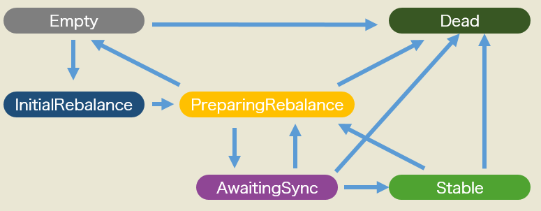

- initialRebalance
  初始化在均衡，一般由第一个消费者加入组时触发,初始化完毕后进入preparingRebalance状态

- preparingRebalance
  准备在均衡，等待到超时时间后，对join_group请求进行响应，然后进入awaitingSync状态

- awaitingSync
  此时等待customer group leader 发起Sync_group请求。customer group leader 发起sync_group请求后，响应其他customer的sync_group请求，进入stable状态

- stable 
  稳定状态，组内成员发生改变时进入preparingRebalance状态，进行下一轮的再均衡

## FIND_COORDINATOR

#### 功能

消费者初始化时，会查询coordinator,这个协调者会负责组成员、心跳事件、offset、再均衡的管理。

> kafka使用了一个特殊主题__customer_offset 来管理offset，默认该主题有50个分片，会根据消费组Id的 hash 来确定commit_offset消息被储存于那个分片，这个分片leader所在的broker就会成为该消费组的coordinator 

#### 请求

```
FindCoordinator Request (Version: 4) => key_type [coordinator_keys] TAG_BUFFER 
  key_type => INT8
  coordinator_keys => COMPACT_STRING
```

| FIELD          | DESCRIPTION                                                                                                  |
| -------------- | ------------------------------------------------------------------------------------------------------------ |
| key            | The coordinator key.消费者时，即GROUPID                                                                            |
| key_type       | The coordinator key type. (Group, transaction, etc.)*GROUP*((byte) 0), *TRANSACTION*((byte) 1);消费者时，固定为group |
| _tagged_fields | The tagged fields                                                                                            |

#### 响应

```
FindCoordinator Response (Version: 4) => throttle_time_ms [coordinators] TAG_BUFFER 
  throttle_time_ms => INT32
  coordinators => key node_id host port error_code error_message TAG_BUFFER 
    key => COMPACT_STRING
    node_id => INT32
    host => COMPACT_STRING
    port => INT32
    error_code => INT16
    error_message => COMPACT_NULLABLE_STRING
```

| FIELD            | DESCRIPTION                                                                                                                                  |
| ---------------- | -------------------------------------------------------------------------------------------------------------------------------------------- |
| throttle_time_ms | The duration in milliseconds for which the request was throttled due to a quota violation, or zero if the request did not violate any quota. |
| coordinators     | Each coordinator result in the response<br/>对消费者而言，客户端会对返回的集合做判断，如果集合大小不是1，会抛出错误                                                             |
| key              | The coordinator key.                                                                                                                         |
| node_id          | The node id.                                                                                                                                 |
| host             | The host name.                                                                                                                               |
| port             | The port.                                                                                                                                    |
| error_code       | The error code, or 0 if there was no error.                                                                                                  |
| error_message    | The error message, or null if there was no error.                                                                                            |
| _tagged_fields   | The tagged fields                                                                                                                            |
| _tagged_fields   | The tagged fields                                                                                                                            |

## JOIN_GROUP

#### 功能

在coordinator就绪后，customer初始化或被通知再均衡时，customer通过该协议进入再均衡流程。

#### 请求

```
JoinGroup Request (Version: 9) => group_id session_timeout_ms rebalance_timeout_ms member_id group_instance_id protocol_type [protocols] reason TAG_BUFFER 
  group_id => COMPACT_STRING
  session_timeout_ms => INT32
  rebalance_timeout_ms => INT32
  member_id => COMPACT_STRING
  group_instance_id => COMPACT_NULLABLE_STRING
  protocol_type => COMPACT_STRING
  protocols => name metadata TAG_BUFFER 
    name => COMPACT_STRING
    metadata => COMPACT_BYTES
  reason => COMPACT_NULLABLE_STRING
```

| FIELD                | DESCRIPTION                                                                                                                                                                            |
| -------------------- | -------------------------------------------------------------------------------------------------------------------------------------------------------------------------------------- |
| group_id             | The group identifier.                                                                                                                                                                  |
| session_timeout_ms   | The coordinator considers the consumer dead if it receives no heartbeat after this timeout in milliseconds.心跳控制                                                                        |
| rebalance_timeout_ms | The maximum time in milliseconds that the coordinator will wait for each member to rejoin when rebalancing the group.对消费者而言是配置中max.poll.interval.ms，即2次poll之间的间隔，超过这个间隔会被移除消费组，触发重新平衡。 |
| member_id            | The member id assigned by the group coordinator.第一次加入时可能为空                                                                                                                             |
| group_instance_id    | The unique identifier of the consumer instance provided by end user.第一次加入时可能为空                                                                                                         |
| protocol_type        | The unique name the for class of protocols implemented by the group we want to join.对消费者而言，是“consumer”                                                                                 |
| protocols            | The list of protocols that the member supports.//上传的是各个消费者支持的分区策略 和 订阅topics，ps:如果是正则模式订阅，上一步MetaData中会返回所有的主题，客户端会在FindCoordinator后，选择符合的主题                                           |
| name                 | The protocol name.//分区策略名称                                                                                                                                                             |
| metadata             | The protocol metadata.<br/>`[{topics:"",userData:""ownedPartitions:"" ;第一次通常为空groupInstanceId：“”值Optional.*empty*()}]`                                                                 |
| _tagged_fields       | The tagged fields                                                                                                                                                                      |
| reason               | The reason why the member (re-)joins the group.                                                                                                                                        |
| _tagged_fields       | The tagged fields                                                                                                                                                                      |

#### 响应

```
JoinGroup Response (Version: 9) => throttle_time_ms error_code generation_id protocol_type protocol_name leader skip_assignment member_id [members] TAG_BUFFER 
  throttle_time_ms => INT32
  error_code => INT16
  generation_id => INT32
  protocol_type => COMPACT_NULLABLE_STRING
  protocol_name => COMPACT_NULLABLE_STRING
  leader => COMPACT_STRING
  skip_assignment => BOOLEAN
  member_id => COMPACT_STRING
  members => member_id group_instance_id metadata TAG_BUFFER 
    member_id => COMPACT_STRING
    group_instance_id => COMPACT_NULLABLE_STRING
    metadata => COMPACT_BYTES
```

| FIELD             | DESCRIPTION                                                                                                                                  |
| ----------------- | -------------------------------------------------------------------------------------------------------------------------------------------- |
| throttle_time_ms  | The duration in milliseconds for which the request was throttled due to a quota violation, or zero if the request did not violate any quota. |
| error_code        | The error code, or 0 if there was no error.                                                                                                  |
| generation_id     | The generation ID of the group.                                                                                                              |
| protocol_type     | The group protocol name.//cons                                                                                                               |
| protocol_name     | The group protocol selected by the coordinator.                                                                                              |
| leader            | The leader of the group.                                                                                                                     |
| skip_assignment   | True if the leader must skip running the assignment.//设置为true时，被选为leader的customer不会返回分配结果                                                    |
| member_id         | The member ID assigned by the group coordinator.                                                                                             |
| members           |                                                                                                                                              |
| member_id         | The group member ID.//consumer-test_1-1-3e48638d-ab17-4eef-b382-18e7ac2896f1                                                                 |
| group_instance_id | The unique identifier of the consumer instance provided by end user.                                                                         |
| metadata          | The group member metadata.//客户端处理中似乎没有用到该字段                                                                                                  |
| _tagged_fields    | The tagged fields                                                                                                                            |
| _tagged_fields    | The tagged fields                                                                                                                            |

## SYNC_GROUP

#### 功能

在收到JOIN_GROUP response 之后，由客户端发起，请求获取分配结果。如果是topic leader,会同时上传分配结果

> kafka允许客户端自定义s消费者分配策略，配置参数：partition.assignment.strategy
> 默认设置：
> 
> ```
> define(PARTITION_ASSIGNMENT_STRATEGY_CONFIG,
>  ConfigDef.Type.LIST,
>  Arrays.asList(RangeAssignor.class, CooperativeStickyAssignor.class),
>  new ConfigDef.NonNullValidator(),
>  ConfigDef.Importance.MEDIUM,>  PARTITION_ASSIGNMENT_STRATEGY_DOC)
> ```

#### 请求

```
SyncGroup Request (Version: 5) => group_id generation_id member_id group_instance_id protocol_type protocol_name [assignments] TAG_BUFFER 
group_id => COMPACT_STRING
 generation_id => INT32
 member_id => COMPACT_STRING
 group_instance_id => COMPACT_NULLABLE_STRING
 protocol_type => COMPACT_NULLABLE_STRING
 protocol_name => COMPACT_NULLABLE_STRING
 assignments => member_id assignment TAG_BUFFER 
 member_id => COMPACT_STRING
 assignment => COMPACT_BYTES
```

| FIELD             | DESCRIPTION                                                                                                                                                                                                                                                                |
| ----------------- | -------------------------------------------------------------------------------------------------------------------------------------------------------------------------------------------------------------------------------------------------------------------------- |
| group_id          | The unique group identifier.                                                                                                                                                                                                                                               |
| generation_id     | The generation of the group.//分配的Gruop id,服务端会做校验，由JOIN_GROUP返回                                                                                                                                                                                                            |
| member_id         | The member ID assigned by the group.                                                                                                                                                                                                                                       |
| group_instance_id | The unique identifier of the consumer instance provided by end user.                                                                                                                                                                                                       |
| protocol_type     | The group protocol type.                                                                                                                                                                                                                                                   |
| protocol_name     | The group protocol name.                                                                                                                                                                                                                                                   |
| assignments       | Each assignment.分配结果<br/>`[ "key": "consumer-test_1-1-1d9f0fcd-1240-4e92-8567-e35b268c55a7",      "value": {         "partitions": [            {               "topic": "xxx",               "partition": 0            }         ],         "userData": null      }   }]` |
| member_id         | The ID of the member to assign.                                                                                                                                                                                                                                            |
| assignment        | The member assignment.                                                                                                                                                                                                                                                     |
| _tagged_fields    | The tagged fields                                                                                                                                                                                                                                                          |
| _tagged_fields    | The tagged fields                                                                                                                                                                                                                                                          |

#### 响应

```
SyncGroup Response (Version: 5) => throttle_time_ms error_code protocol_type protocol_name assignment TAG_BUFFER 
  throttle_time_ms => INT32
  error_code => INT16
  protocol_type => COMPACT_NULLABLE_STRING
  protocol_name => COMPACT_NULLABLE_STRING
  assignment => COMPACT_BYTES
```

| FIELD            | DESCRIPTION                                                                                                                                  |
| ---------------- | -------------------------------------------------------------------------------------------------------------------------------------------- |
| throttle_time_ms | The duration in milliseconds for which the request was throttled due to a quota violation, or zero if the request did not violate any quota. |
| error_code       | The error code, or 0 if there was no error.                                                                                                  |
| protocol_type    | The group protocol type.                                                                                                                     |
| protocol_name    | The group protocol name.                                                                                                                     |
| assignment       | The member assignment. <br/>`{"partitions":[{"topic":"xxxx",partition:0}]}`                                                                  |
| _tagged_fields   | The tagged fields                                                                                                                            |

## OFFSET_FETCH

##### 功能

拉取已commited offset,消费者启动SYNC_GROUP之后会进行查询，或者主动调用committed()接口也会发起查询，OFFSET 由Coordinator管理

##### 请求

```
OffsetFetch Request (Version: 8) => [groups] require_stable TAG_BUFFER 
  groups => group_id [topics] TAG_BUFFER 
    group_id => COMPACT_STRING
    topics => name [partition_indexes] TAG_BUFFER 
      name => COMPACT_STRING
      partition_indexes => INT32
  require_stable => BOOLEAN
```

| FIELD             | DESCRIPTION                                                                                                 |
| ----------------- | ----------------------------------------------------------------------------------------------------------- |
| groups            | Each group we would like to fetch offsets for                                                               |
| group_id          | The group ID.                                                                                               |
| topics            | Each topic we would like to fetch offsets for, or null to fetch offsets for all topics.                     |
| name              | The topic name.                                                                                             |
| partition_indexes | The partition indexes we would like to fetch offsets for.                                                   |
| _tagged_fields    | The tagged fields                                                                                           |
| _tagged_fields    | The tagged fields                                                                                           |
| require_stable    | Whether broker should hold on returning unstable offsets but set a retriable error code for the partitions. |
| _tagged_fields    | The tagged fields                                                                                           |

##### 响应

```
OffsetFetch Response (Version: 6) => throttle_time_ms [topics] error_code TAG_BUFFER 
  throttle_time_ms => INT32
  topics => name [partitions] TAG_BUFFER 
    name => COMPACT_STRING
    partitions => partition_index committed_offset committed_leader_epoch metadata error_code TAG_BUFFER 
      partition_index => INT32
      committed_offset => INT64
      committed_leader_epoch => INT32
      metadata => COMPACT_NULLABLE_STRING
      error_code => INT16
  error_code => INT16
```

| FIELD                  | DESCRIPTION                                                                                                                                  |
| ---------------------- | -------------------------------------------------------------------------------------------------------------------------------------------- |
| throttle_time_ms       | The duration in milliseconds for which the request was throttled due to a quota violation, or zero if the request did not violate any quota. |
| topics                 | The responses per topic.                                                                                                                     |
| name                   | The topic name.                                                                                                                              |
| partitions             | The responses per partition                                                                                                                  |
| partition_index        | The partition index.                                                                                                                         |
| committed_offset       | The committed message offset.                                                                                                                |
| committed_leader_epoch | The leader epoch.                                                                                                                            |
| metadata               | The partition metadata.                                                                                                                      |
| error_code             | The error code, or 0 if there was no error.                                                                                                  |
| error_code             | The top-level error code, or 0 if there was no error.                                                                                        |

##### 相关错误码

```
Errors.COORDINATOR_LOAD_IN_PROGRESS
Errors.NOT_COORDINATOR
Errors.GROUP_AUTHORIZATION_FAILED

//topic partition错误
Errors.UNKNOWN_TOPIC_OR_PARTITION
Errors.TOPIC_AUTHORIZATION_FAILED
Errors.UNSTABLE_OFFSET_COMMIT
```

## HEARTBEAT

##### 功能

向 Coordinator 发送心跳，超过 sessionTimeout 后未发心跳会被认为已离线，同时coordinator通过对该协议的响应来通知客户端进行再均衡

##### 请求

```
Heartbeat Request (Version: 4) => group_id generation_id member_id group_instance_id TAG_BUFFER 
  group_id => COMPACT_STRING
  generation_id => INT32
  member_id => COMPACT_STRING
  group_instance_id => COMPACT_NULLABLE_STRING
```

| FIELD             | DESCRIPTION                                                          |
| ----------------- | -------------------------------------------------------------------- |
| group_id          | The group id.//String                                                |
| generation_id     | The generation of the group.//                                       |
| member_id         | The member ID.                                                       |
| group_instance_id | The unique identifier of the consumer instance provided by end user. |
| _tagged_fields    | The tagged fields                                                    |

##### 响应

```
Heartbeat Response (Version: 4) => throttle_time_ms error_code TAG_BUFFER 
  throttle_time_ms => INT32
  error_code => INT16
```

| FIELD            | DESCRIPTION                                                                                                                                  |
| ---------------- | -------------------------------------------------------------------------------------------------------------------------------------------- |
| throttle_time_ms | The duration in milliseconds for which the request was throttled due to a quota violation, or zero if the request did not violate any quota. |
| error_code       | The error code, or 0 if there was no error.<br/>                                                                                             |
| _tagged_fields   | The tagged fields                                                                                                                            |

##### 相关错误码

```
Errors.COORDINATOR_NOT_AVAILABLE
Errors.NOT_COORDINATOR

//重平衡触发错误
Errors.REBALANCE_IN_PROGRESS

Errors.ILLEGAL_GENERATION
Errors.UNKNOWN_MEMBER_ID
Errors.FENCED_INSTANCE_ID
Errors.GROUP_AUTHORIZATION_FAILED
```

## OFFSET_COMMIT

##### 功能

提交offset commit, commited_offset 会作为customer重启或再均衡后拉取的起始位置

##### 请求

```
OffsetCommit Request (Version: 8) => group_id generation_id member_id group_instance_id [topics] TAG_BUFFER 
  group_id => COMPACT_STRING
  generation_id => INT32
  member_id => COMPACT_STRING
  group_instance_id => COMPACT_NULLABLE_STRING
  topics => name [partitions] TAG_BUFFER 
    name => COMPACT_STRING
    partitions => partition_index committed_offset committed_leader_epoch committed_metadata TAG_BUFFER 
      partition_index => INT32
      committed_offset => INT64
      committed_leader_epoch => INT32
      committed_metadata => COMPACT_NULLABLE_STRING
```

| FIELD                  | DESCRIPTION                                                          |
| ---------------------- | -------------------------------------------------------------------- |
| group_id               | The unique group identifier.                                         |
| generation_id          | The generation of the group.                                         |
| member_id              | The member ID assigned by the group coordinator.                     |
| group_instance_id      | The unique identifier of the consumer instance provided by end user. |
| topics                 | The topics to commit offsets for.                                    |
| name                   | The topic name.                                                      |
| partitions             | Each partition to commit offsets for.                                |
| partition_index        | The partition index.                                                 |
| committed_offset       | The message offset to be committed.                                  |
| committed_leader_epoch | The leader epoch of this partition.                                  |
| committed_metadata     | Any associated metadata the client wants to keep.                    |
| _tagged_fields         | The tagged fields                                                    |
| _tagged_fields         | The tagged fields                                                    |
| _tagged_fields         | The tagged fields                                                    |

##### 响应

```
OffsetCommit Response (Version: 8) => throttle_time_ms [topics] TAG_BUFFER 
  throttle_time_ms => INT32
  topics => name [partitions] TAG_BUFFER 
    name => COMPACT_STRING
    partitions => partition_index error_code TAG_BUFFER 
      partition_index => INT32
      error_code => INT16ABLE_STRING
```

| FIELD            | DESCRIPTION                                                                                                                                  |
| ---------------- | -------------------------------------------------------------------------------------------------------------------------------------------- |
| throttle_time_ms | The duration in milliseconds for which the request was throttled due to a quota violation, or zero if the request did not violate any quota. |
| topics           | The responses for each topic.                                                                                                                |
| name             | The topic name.                                                                                                                              |
| partitions       | The responses for each partition in the topic.                                                                                               |
| partition_index  | The partition index.                                                                                                                         |
| error_code       | The error code, or 0 if there was no error.                                                                                                  |
| _tagged_fields   | The tagged fields                                                                                                                            |
| _tagged_fields   | The tagged fields                                                                                                                            |
| _tagged_fields   | The tagged fields                                                                                                                            |

## LEAVE_GROUP

##### 功能

退出消费组

##### 请求

```
LeaveGroup Request (Version: 5) => group_id [members] TAG_BUFFER 
  group_id => COMPACT_STRING
  members => member_id group_instance_id reason TAG_BUFFER 
    member_id => COMPACT_STRING
    group_instance_id => COMPACT_NULLABLE_STRING
    reason => COMPACT_NULLABLE_STRING
```

| FIELD             | DESCRIPTION                                     |
| ----------------- | ----------------------------------------------- |
| group_id          | The ID of the group to leave.                   |
| members           | List of leaving member identities.              |
| member_id         | The member ID to remove from the group.         |
| group_instance_id | The group instance ID to remove from the group. |
| reason            | The reason why the member left the group.       |
| _tagged_fields    | The tagged fields                               |
| _tagged_fields    | The tagged fields                               |

##### 响应

```
LeaveGroup Response (Version: 5) => throttle_time_ms error_code [members] TAG_BUFFER 
  throttle_time_ms => INT32
  error_code => INT16
  members => member_id group_instance_id error_code TAG_BUFFER 
    member_id => COMPACT_STRING
    group_instance_id => COMPACT_NULLABLE_STRING
    error_code => INT16
```

| throttle_time_ms  | The duration in milliseconds for which the request was throttled due to a quota violation, or zero if the request did not violate any quota. |
| ----------------- | -------------------------------------------------------------------------------------------------------------------------------------------- |
| error_code        | The error code, or 0 if there was no error.                                                                                                  |
| members           | List of leaving member responses.                                                                                                            |
| member_id         | The member ID to remove from the group.                                                                                                      |
| group_instance_id | The group instance ID to remove from the group.                                                                                              |
| error_code        | The error code, or 0 if there was no error.                                                                                                  |
| _tagged_fields    | The tagged fields                                                                                                                            |
| _tagged_fields    | The tagged fields                                                                                                                            |

## FETCH

##### 功能

消费者主动拉取消息的核心API。也是副本同步时拉取消息的核心api

##### 请求

```
Fetch Request (Version: 13) => replica_id max_wait_ms min_bytes max_bytes isolation_level session_id session_epoch [topics] [forgotten_topics_data] rack_id TAG_BUFFER 
  replica_id => INT32
  max_wait_ms => INT32
  min_bytes => INT32
  max_bytes => INT32
  isolation_level => INT8
  session_id => INT32
  session_epoch => INT32
  topics => topic_id [partitions] TAG_BUFFER 
    topic_id => UUID
    partitions => partition current_leader_epoch fetch_offset last_fetched_epoch log_start_offset partition_max_bytes TAG_BUFFER 
      partition => INT32
      current_leader_epoch => INT32
      fetch_offset => INT64
      last_fetched_epoch => INT32
      log_start_offset => INT64
      partition_max_bytes => INT32
  forgotten_topics_data => topic_id [partitions] TAG_BUFFER 
    topic_id => UUID
    partitions => INT32
  rack_id => COMPACT_STRING
```

| FIELD                 | DESCRIPTION                                                                                                                                                                                                                                                                                                                                                                                                                                                                                                            |
| --------------------- | ---------------------------------------------------------------------------------------------------------------------------------------------------------------------------------------------------------------------------------------------------------------------------------------------------------------------------------------------------------------------------------------------------------------------------------------------------------------------------------------------------------------------- |
| replica_id            | The broker ID of the follower, of -1 if this request is from a consumer.                                                                                                                                                                                                                                                                                                                                                                                                                                               |
| max_wait_ms           | The maximum time in milliseconds to wait for the response.                                                                                                                                                                                                                                                                                                                                                                                                                                                             |
| min_bytes             | The minimum bytes to accumulate in the response.                                                                                                                                                                                                                                                                                                                                                                                                                                                                       |
| max_bytes             | The maximum bytes to fetch. See KIP-74 for cases where this limit may not be honored.                                                                                                                                                                                                                                                                                                                                                                                                                                  |
| isolation_level       | This setting controls the visibility of transactional records. Using READ_UNCOMMITTED (isolation_level = 0) makes all records visible. With READ_COMMITTED (isolation_level = 1), non-transactional and COMMITTED transactional records are visible. To be more concrete, READ_COMMITTED returns all data from offsets smaller than the current LSO (last stable offset), and enables the inclusion of the list of aborted transactions in the result, which allows consumers to discard ABORTED transactional records |
| session_id            | The fetch session ID.//session_id 由服务端控制// *INVALID_SESSION_ID = 0**//消费者*会对这个 topic 所属的 session 做验证                                                                                                                                                                                                                                                                                                                                                                                                                   |
| session_epoch         | The fetch session epoch, which is used for ordering requests in a session.由客户端递增，                                                                                                                                                                                                                                                                                                                                                                                                                                      |
| topics                | The topics to fetch.                                                                                                                                                                                                                                                                                                                                                                                                                                                                                                   |
| topic_id              | The unique topic ID                                                                                                                                                                                                                                                                                                                                                                                                                                                                                                    |
| partitions            | The partitions to fetch.                                                                                                                                                                                                                                                                                                                                                                                                                                                                                               |
| partition             | The partition index.                                                                                                                                                                                                                                                                                                                                                                                                                                                                                                   |
| current_leader_epoch  | The current leader epoch of the partition.                                                                                                                                                                                                                                                                                                                                                                                                                                                                             |
| fetch_offset          | The message offset.                                                                                                                                                                                                                                                                                                                                                                                                                                                                                                    |
| last_fetched_epoch    | The epoch of the last fetched record or -1 if there is none                                                                                                                                                                                                                                                                                                                                                                                                                                                            |
| log_start_offset      | The earliest available offset of the follower replica. The field is only used when the request is sent by the follower.                                                                                                                                                                                                                                                                                                                                                                                                |
| partition_max_bytes   | The maximum bytes to fetch from this partition. See KIP-74 for cases where this limit may not be honored.                                                                                                                                                                                                                                                                                                                                                                                                              |
| _tagged_fields        | The tagged fields                                                                                                                                                                                                                                                                                                                                                                                                                                                                                                      |
| _tagged_fields        | The tagged fields                                                                                                                                                                                                                                                                                                                                                                                                                                                                                                      |
| forgotten_topics_data | In an incremental fetch request, the partitions to remove.                                                                                                                                                                                                                                                                                                                                                                                                                                                             |
| topic_id              | The unique topic ID                                                                                                                                                                                                                                                                                                                                                                                                                                                                                                    |
| partitions            | The partitions indexes to forget.                                                                                                                                                                                                                                                                                                                                                                                                                                                                                      |
| _tagged_fields        | The tagged fields                                                                                                                                                                                                                                                                                                                                                                                                                                                                                                      |
| rack_id               | Rack ID of the consumer making this request                                                                                                                                                                                                                                                                                                                                                                                                                                                                            |
| _tagged_fields        | The tagged fields                                                                                                                                                                                                                                                                                                                                                                                                                                                                                                      |

##### 响应

```
Fetch Response (Version: 13) => throttle_time_ms error_code session_id [responses] TAG_BUFFER 
  throttle_time_ms => INT32
  error_code => INT16
  session_id => INT32
  responses => topic_id [partitions] TAG_BUFFER 
    topic_id => UUID
    partitions => partition_index error_code high_watermark last_stable_offset log_start_offset [aborted_transactions] preferred_read_replica records TAG_BUFFER 
      partition_index => INT32
      error_code => INT16
      high_watermark => INT64
      last_stable_offset => INT64
      log_start_offset => INT64
      aborted_transactions => producer_id first_offset TAG_BUFFER 
        producer_id => INT64
        first_offset => INT64
      preferred_read_replica => INT32
      records => COMPACT_RECORDS
```

| FIELD                  | DESCRIPTION                                                                                                                                                                              |
| ---------------------- | ---------------------------------------------------------------------------------------------------------------------------------------------------------------------------------------- |
| throttle_time_ms       | The duration in milliseconds for which the request was throttled due to a quota violation, or zero if the request did not violate any quota.                                             |
| error_code             | The top level response error code.                                                                                                                                                       |
| session_id             | The fetch session ID, or 0 if this is not part of a fetch session.                                                                                                                       |
| responses              | The response topics.                                                                                                                                                                     |
| topic_id               | The unique topic ID                                                                                                                                                                      |
| partitions             | The topic partitions.                                                                                                                                                                    |
| partition_index        | The partition index.                                                                                                                                                                     |
| error_code             | The error code, or 0 if there was no fetch error.                                                                                                                                        |
| high_watermark         | The current high water mark.                                                                                                                                                             |
| last_stable_offset     | The last stable offset (or LSO) of the partition. This is the last offset such that the state of all transactional records prior to this offset have been decided (ABORTED or COMMITTED) |
| log_start_offset       | The current log start offset.                                                                                                                                                            |
| aborted_transactions   | The aborted transactions.                                                                                                                                                                |
| producer_id            | The producer id associated with the aborted transaction.                                                                                                                                 |
| first_offset           | The first offset in the aborted transaction.                                                                                                                                             |
| _tagged_fields         | The tagged fields                                                                                                                                                                        |
| preferred_read_replica | The preferred read replica for the consumer to use on its next fetch request//下一次拉取节点                                                                                                    |
| records                | The record data.                                                                                                                                                                         |
| _tagged_fields         | The tagged fields                                                                                                                                                                        |
| _tagged_fields         | The tagged fields                                                                                                                                                                        |
| _tagged_fields         | The tagged fields                                                                                                                                                                        |

##### 相关错误码

```
Errors.NOT_LEADER_OR_FOLLOWER 
Errors.REPLICA_NOT_AVAILABLE
Errors.KAFKA_STORAGE_ERROR 
Errors.FENCED_LEADER_EPOCH
Errors.OFFSET_NOT_AVAILABLE
Errors.UNKNOWN_TOPIC_OR_PARTITION
Errors.UNKNOWN_TOPIC_ID
Errors.INCONSISTENT_TOPIC_ID
Errors.OFFSET_OUT_OF_RANGE
Errors.TOPIC_AUTHORIZATION_FAILED
Errors.UNKNOWN_LEADER_EPOCH
Errors.UNKNOWN_SERVER_ERROR
Errors.CORRUPT_MESSAGE
```

# kafka事务概述

## kafka 事务提供了 3 个功能

- 多分区原子写入，对单次事务多个消息，要吗全部提交成功，要吗全部提交失败
- 粉碎“僵尸实例”，保证对单个事务 id,只有一个 producor 可以进行事务性写入
- 读事务消息，对消费者，提供读提交和读未提交的能力

## 事务处理 api 和相关参数

 producer 提供了五个事务方法：

1. initTransactions
2. beginTransaction
3. sendOffsets
4. commitTransaction
5. abortTransaction

生产者配置

1. enable.idempotence：开启幂等
   所谓幂等 producer 指 producer.send 的逻辑是幂等的，即发送相同的 Kafka 消息，broker 端不会重复写入消息。同一条消息 Kafka 保证底层日志中只会持久化一次，既不会丢失也不会重复。幂等性可以极大地减轻下游 consumer 系统实现消息去重的工作负担，因此是非常实用的功能。值得注意的是，幂等 producer 提供的语义保证是有条件的：
   
   - 单分区幂等性：幂等 producer 无法实现多分区上的幂等性。如前所述，若要实现多分区上的原子性，需要引入事务
   
   - 单会话幂等性：幂等 producer 无法跨会话实现幂等性。即使同一个 producer 宕机并重启也无法保证消息的 EOS 语义
   
   虽然有上面两个限制，幂等 producer 依然是一个非常实用的新功能。下面我们来讨论下它的设计原理。如果要实现幂等性， 通常都需要花费额外的空间来保存状态以执行消息去重。Kafka 的幂等 producer 整体上也是这样的思想。
   
   首先，producer 对象引入了一个新的字段：Producer ID(下称 PID)，它唯一标识一个 producer，当 producer 启动时 Kafka 会为每个 producer 分配一个 PID（64 位整数），因此 PID 的生成和分配对用户来说是完全透明的，用户无需考虑 PID 的事情，甚至都感受不到 PID 的存在。其次，0.11 Kafka 重构了消息格式，引入了序列号字段(sequence number，下称 seq number)来标识某个 PID producer 发送的消息。和 consumer 端的 offset 类似，seq number 从 0 开始计数并严格单调增加。同时在 broker 端会为每个 PID(即每个 producer)保存该 producer 发送过来的消息 batch 的某些元信息，比如 PID 信息、消息 batch 的起始 seq number 及结束 seq number 等。这样每当该 PID 发送新的消息 batch 时，Kafka broker 就会对比这些信息，如果发生冲突(比如起始 seq number 和结束 seq number 与当前缓存的相同)，那么 broker 就会拒绝这次写入请求。倘若没有冲突，那么 broker 端就会更新这部分缓存然后再开始写入消息。这就是 Kafka 实现幂等 producer 的设计思路：
   
   1. 为每个 producer 设置唯一的 PID；
   
   2. 引入 seq number 以及 broker 端 seq number 缓存更新机制来去重。

2. transaction.timeout.ms：事务超时时间
   事务协调器在主动中止正在进行的事务之前等待生产者更新事务状态的最长时间。
   这个配置值将与 InitPidRequest 一起发送到事务协调器。如果该值大于 max.transaction.timeout。在 broke 中设置 ms 时，请求将失败，并出现 InvalidTransactionTimeout 错误。默认是 60000。这使得交易不会阻塞下游消费超过一分钟，这在实时应用程序中通常是允许的。

3. transactional.id
   用于事务性交付的 TransactionalId。这支持跨多个生产者会话的可靠性语义，因为它允许客户端确保使用相同 TransactionalId 的事务在启动任何新事务之前已经完成。如果没有提供 TransactionalId，则生产者仅限于幂等交付。

消费者配置

1. isolation.level
   
   - read_uncommitted:以偏移顺序使用已提交和未提交的消息。- 
   
   - read_committed:仅以偏移量顺序使用非事务性消息或已提交事务性消息。为了维护偏移排序，这个设置意味着我们必须在使用者中缓冲消息，直到看到给定事务中的所有消息。

# 事务相关协议

todo

# kafka服务端io模型概述

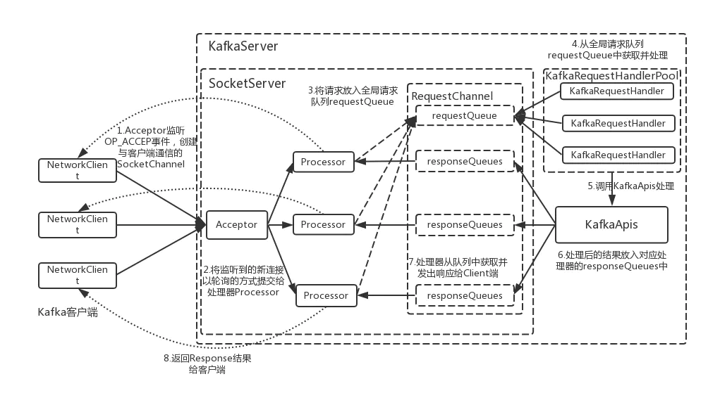

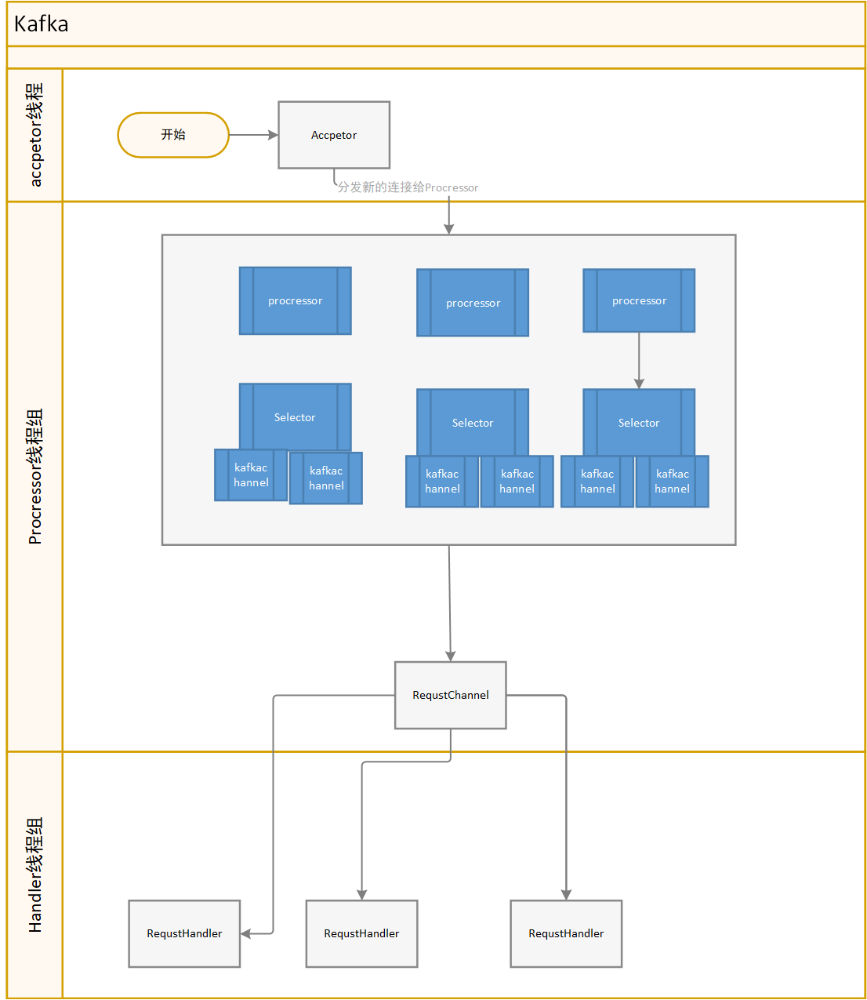

- Acceptor
  监听并接受新链接，然后将新的连接交给Processor处理

- Processor
  每个processor绑定一个kafka Selector,processor借助Selector获取请求和发送消息，Processor还会维护一个响应队列。在Selector 每一个poll周期内，会发送响应队列中的响应并且读取新的请求，Processor会将请求进行反序列化组装后放入RequestChannel 持有的全局请求队列中。

- RequestHandler
  requestHandler 负责调用kafkaApis进行具体的处理，处理结果将会放入Processor的响应队列中。

# kafka Selector 概述

todo

# demo代理服务解决方案和无法确定的问题

## 项目结构

代理服务直接kafka服务端的io模型，这么做的好处是不用关心kafka和各个版本的兼容性处理、序列化和反序列化处理。我们只需要重写KakfakApis部分，根据不同的协议功能向htp系统写入或者拉取数据。

demo项目使用gradle作为构建工具，划分了三个模块

- base
  Java代码模块，对应kafka3.3 源码中的clients模块，包含序列化/反序列化等客户端可服务端公用的类

- sever_common
  
  Java代码模块，对应kafka3.3源码中的sever_common模块，包含服务端需要使用的工具类等。

- sever
  
  scala代码，对应kafka3.3源码中的core模块，服务端核心代码，需要实现的代码均位于该模块。

sever模块的代码主要包含2个部分：

- 从kafka3.3中分离出的io模块
  
  - 协议序列化和反序列化再这部分完成，详见Processor

- AdapterRequestHandler，这部分是对KakfakApis的重写，负责具体的协议处理，demo目前只支持htp系统单机，代理服务器单机的情况。

## 无法确定的问题

##### partition支持（优先级：高）

- 问题描述

kafka允许自定义分区分配策略（发送消息时和重平衡时），在kafka中分区数量是固定的，在topic创建之后就无法发生变更。

kafka通过重平衡流程来确定每一个partition最多只能有一个消费，以此来保证消费者的消费消息的顺序性，并且kafka由客户端来指定下一次来去的offset。分区数量会极大的限制kafka消费者的并发度，同时也会影响用户设置的分区策略。

用户通过分区策略可以将消息发送到指定分区，也可以通过消费者手动指定消费分区策略。

- <span id="jp_1">方案提议1</span>
  
  1. 使用htp 的domain作为kakfak的topic,然后以htp的topic作为kafka的partition 
  
  2. 代理服务增加对应的配置项，来确定分区数量。
     
     - 或者由htp mgr节点来保存配置项？这样代理服务不用储存任何数据
  
  3. 可以通过查询htp domain下的topic数量来确定分区数量

- 方案提议2 <span id="jp_2"></span>
  
  1. 使用htp多级主题来实现partition划分
  2. 代理服务增加配置项来确定默认主题数量
     - 或者由htp mgr节点来保存配置项？这样代理服务不用储存任何数据

- <span id="jp_3">方案提议3</span>
  
  虚拟化partition,客户可以通过mgr接口来随意修改partition数量，htp使用和broker相同的topic来存储消息

这些方案会影响后续的消息顺序支持

##### offset支持（优先级：高）

- 问题描述
  
  tlq 发送消息时并没有返回offset
  消费者初始化后根据commited_offset来确定消费的起始位置,或者可以使用seek系列函数来指定位置开始消费。
  消费者每次poll时，由消费组客户端指定offset。htp系统中，没用根据指定offset拉取的同时，提交committed_offset的功能，（offset>=0的模式不支持进行commit,-1等模式不支持自定义offset拉取）。
- 提议方案
  
  希望htp broker提供对应功能的支持，或者代理服务器自己管理commited_offset,或者htp mgr来储存commited_offset。

##### 消费顺序性支持&重平衡流程（优先级：高）

- 问题描述
  
  kafka消息发送到partition时，按顺序抵达。且kakfa重平衡后，每个partition最多有一个同消费组的消费者进行消费（多余的消费者会被闲置），这样可以保证消息消费的顺序性。且可以尽可能保证消息仅被消费一次（在不发生从重平衡/不执行seek系列API时，消息仅会被消费一次）。
  
  kafka通过重平衡流程来保证每个partition最多有一个同消费组的消费者进行消费，需要对重平衡过程中的`find_coordinator，join_group,sync_group`协议进行支持。demo目前是单机部署，所以问题不大，集群模式下需要考虑coordinator的分配
  
  htp broker和topic的绑定仅支持在 htp mgr 上配置。若不进行绑定，htp客户端的消息会被轮询的发送到broker上，此时进行消息拉取时，消息会被乱序的拉取。
  
  kakfa由客户端进行offset管理，若不实现每个partition最多有一个同消费组的消费者进行消费，会有很多的消息被重复消费

- 方案提议
  
  partition支持使用[提议1](#jp_1)或[提议2](#jp_2) 此时需要实现htp topic和broker绑定来辅助实现消息的顺序性。
  
  partition支持使用[提议3](#jp_3),此时在拉取消息需要以分段锁的模式拉取，即由代理服务器通过分段锁来保证不被重复消费。此方案下实现成本比较高，而且若想重复消费是每次每个kafka 消费者拉取到的消息都不同。
  
  另外要走kafka的重新平衡流程时，需要确定coordinator由哪个代理服务器承担，coordinator需要负责处理`find_coordinator,join_group,sync_group,commit_offset,list_offset`协议。

##### topicId支持

- 问题描述
  kafka topic有个16位的uuid作为topicId,需要根据topicId查询topic。htp系统中topic没有该属性。

- 方案提议
  
  - 由代理服务器来储存topicid,此时代理服务器集群部署时，需要保存数据同步
  - 由htp mgr或者 htp brk 提供支持。

##### 代理服务器集群化后需要同步的数据

- 问题描述
  
  若代理服务器集群化后，部分数据需要做到每个broker之间同步，且需要感知broker之间的存活状态。kakfa客户端可以从任意节点获取全部的代理服务器和topic信息。

- 方案提议
  
  - 代理服务使用raft开源库实现
  
  - mgr提供相应支持。

##### 消息幂等性支持

- 问题描述
  
  kafka通过produceId和mesaage seq来实现消息的幂等性

- 方案提议

# 后续调研方向&待实现的功能

- 代理节点集群化

- 代理节点相关配置完善

- Kafka SASL授权

- kakfa幂等功能支持

- kafka事务处理原理和相应协议
